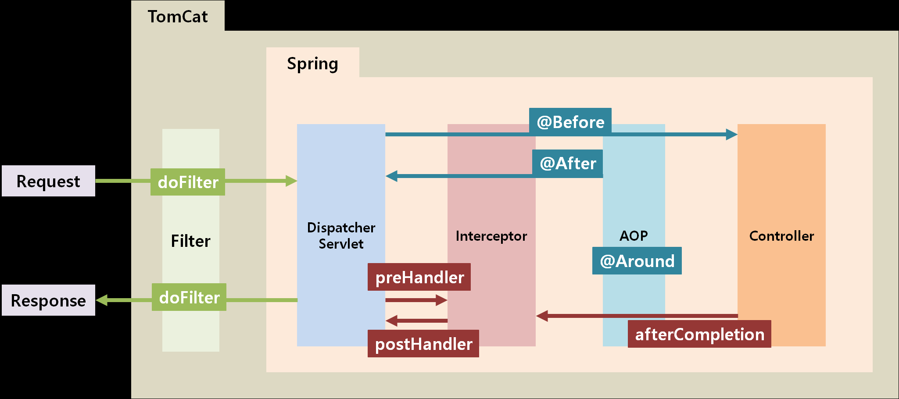

## Spring Filter, Interceptor 그리고 AOP

1. 필터
   - 서블릿 단위에서 실행
   - 인코딩 변환 처리, XSS 방어
   - 요청, 응답시 지정된 자원에 대해 내용을 변경하거나 체크 처리를 수행
   - 전역적, 공통 처리에 대한 부분 위주로 담당
   - web.xml을 통해 설정
   - 스프링 컨텍스트 외부에서 스프링과 무관하게 요청과 응답에 대해 처리
   - 주소로 대상을 구분해서  대상을 지정

2. 인터셉터
    - 서블릿 단위에서 실행
    - 로그인 체크, 권한 체크, 프로그램 실행 시간 계산작업 로그 확인
    - 스프링 컨텍스트 내부에서 요청과 응답에 대해 처리. 그럼으로 스프링의 모든 빈 객체에도 접근 가능
    - servlet-context.xml을 통해 설정
    - 주소로 대상을 구분해서  대상을 지정

3. AOP
    - 메소드 앞에서 프록시 패턴으로 실행
    - 로깅, 트랜잭션, 에러 처리
    - 비즈니스단의 메소드에서 조금 더 세밀하게 조정
    - 주소, 파라미터, 애노테이션 등 다양한 방법으로 대상을 지정

#### 실행 순서 Filter[init(),doFilter()] → Interceptor[preHandler()] → AOP → Interceptor[postHanler()] → Filter[doFilter(),destroy()]

