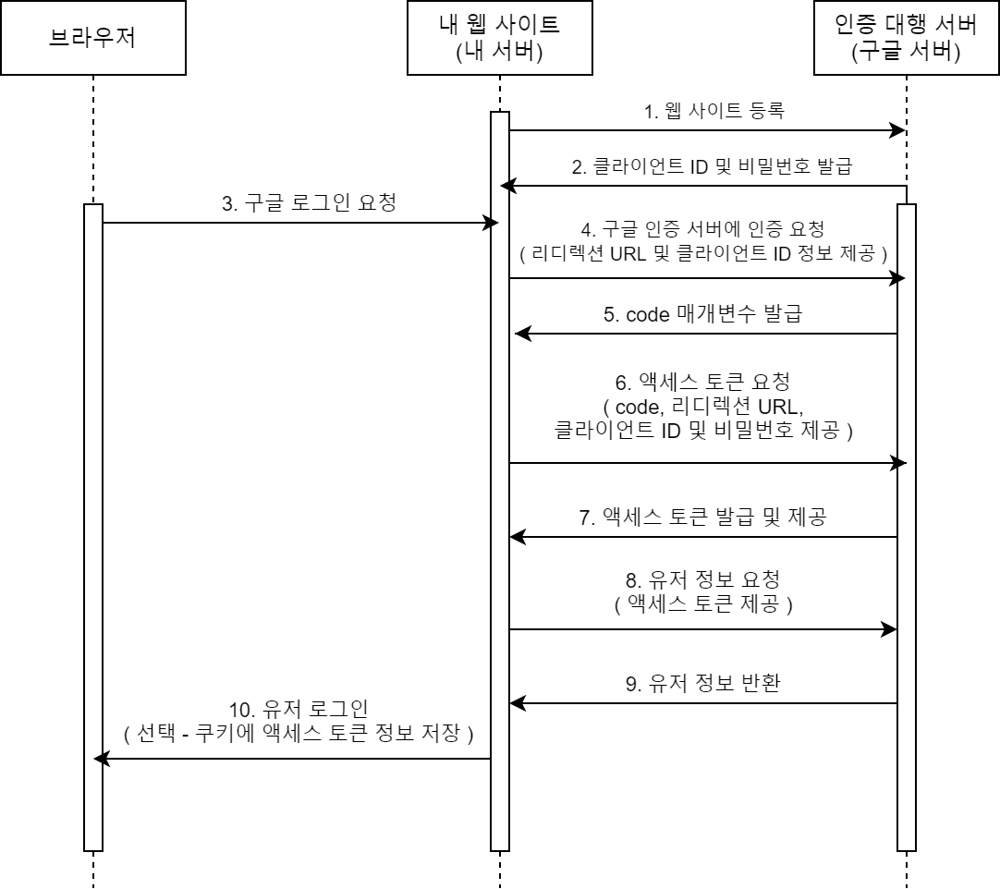
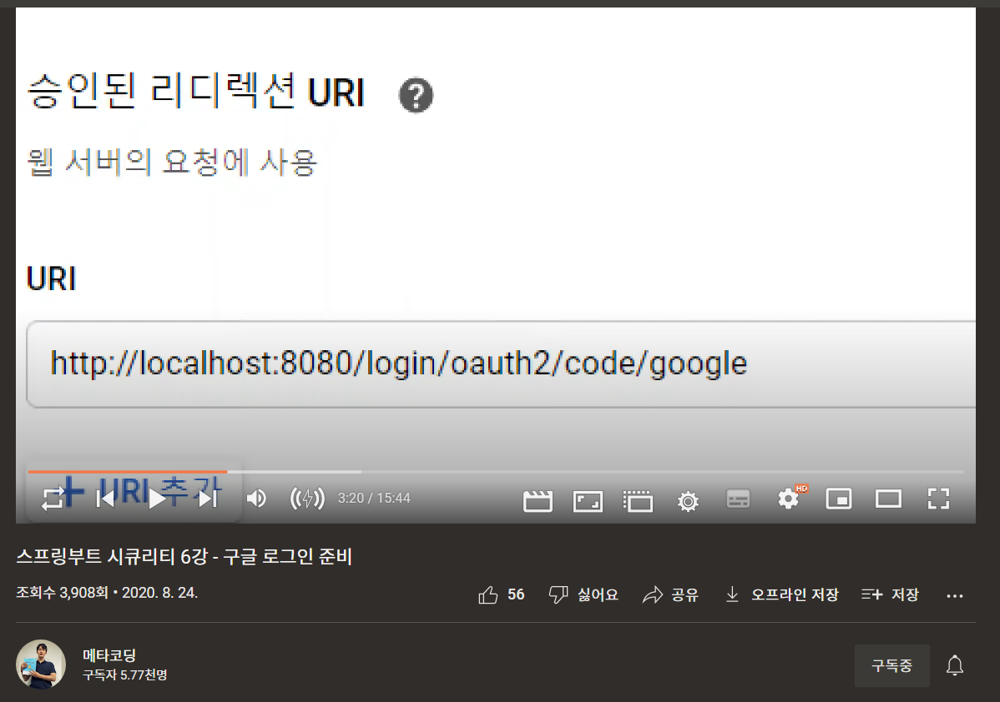

# 리디렉션 URI
## SNS로그인 API에서의 승인된 리디렉션 URI는 무엇인가? 
## 또한 SpringBoot의 Oauth2 Client 라이브러리에서 이 URI를 어떤식으로 캐치하는가.  

- 리디렉션 URI : 인증 대행 서버(SNS)와 인증 정보를 주고 받을 URI
  - localhost:8080으로 URI를 설정해 로컬 브라우저 혹은 로컬 서버로 교류 or 백엔드 서버 주소로 URI를 설정해 로 설정해서 백엔드 서버와 교류
- SpringBoot의 Oauth2 Client 라이브러리 :
  - http://[백엔드_서버주소]/login/oauth2/code/[SNS이름] 의 URI로 들어온 Request를 캐치 후 SNS 인증 서버와 교류
  - 설정 파일(properties・yaml)의 spring.security.oauth2.client.registration.*[SNS이름]* 의 설정 정보에 의해 Spring Security가 클래스 생성

출처: https://sundries-in-myidea.tistory.com/93 [얇고 넓은 개발 블로그]

### SNS 로그인 OAuth인증 흐름

https://velog.io/@piecemaker/OAuth2-%EC%9D%B8%EC%A6%9D-%EB%B0%A9%EC%8B%9D%EC%97%90-%EB%8C%80%ED%95%B4-%EC%95%8C%EC%95%84%EB%B3%B4%EC%9E%90

1. SNS 인증 서버에 리디렉션 URI 등록
2. SNS서버에서 인증을 위한 Client Id,Secret 발행
   1. 백엔드 서버에 Client Id,Secret 설정.
   2. 리디렉션 URI 설정 (SpringBoot의 Oauth2 Client 라이브러리가 자동으로 설정함?)
3. 유저가 브라우저에서 요청
4. 백엔드 서버에서 유저의 SNS로그인 요청 받은 후. SNS 인증 서버에 리디렉션 URI, Client Id와 함께 인증 요청
5. 리디렉션 URI, Client Id가 올바르면 code 발급
6. code와 Client Id,Secret과 함께 AccessToken 발급 요청
7. SNS 서버에서 백엔드 서버에 AccessToken 발급
8. AccessToken을 통해 유저 정보 요청(허가된 정보만 요청가능)
9. 유저 정보 반환
10. 유저 로그인 완료

##### 의문 시간・장소
- 2022/02/19 토요일
- 구글 로그인 API 설정
- 스프링부트 시큐리티 6강 - 구글 로그인 준비
