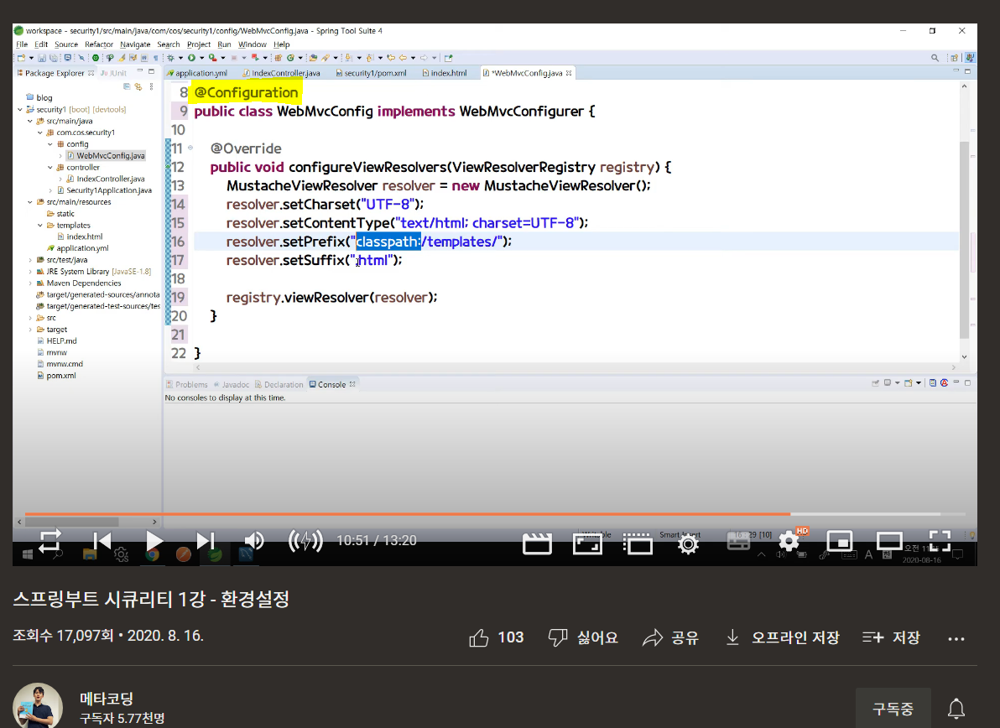

## @Configuration 어노테이션의 역할은?

- @Bean을 직접 등록하고 싶을 때, 클래스 윗부분에 @Configuration 어노테이션 설정.
- @Bean 어노테이션은 개발자가 직접 제어가 불가능한 라이브러리를 사용할때나 초기설정을 하기위해 사용된다.
- @Component 어노테이션은 자동으로 빈을 찾고 등록, @Configuration 어노테이션은 @Bean 어노테이션을 통해 개발자가 수동으로 빈 등록

##### 의문 시간・장소
- 2022/02/19 토요일
- 
- 스프링부트 시큐리티 1강 - 환경 설정
