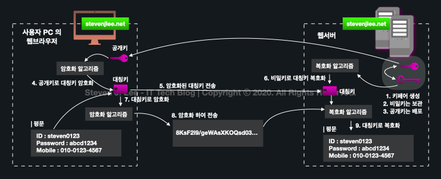
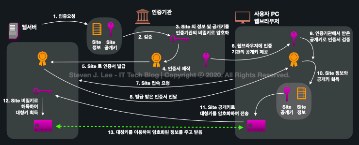

## SSL/TLS 인증방식에서 공개키, 개인키가 어떻게 사용되는가

HTTPS는 HTTP 페이지를 SSL 보안방식을 곁들여 데이터를 주고 받음.

- 하나의 키만 사용하는 대칭키는 처리속도가 빠르지만 암호화키를 탈취당하면 데이터가 해킹당함.
- 두개의 키를 사용하는 비대칭키는 처리속도가 느리지만, 암호화키를 탈취당해도 데이터 해킹불가.
- -> 두가지 방식을 혼합한 하이브리드 방식이 SSL에서 사용됨
  

- 하이브라드 방식은 A가 대칭키, B가 비대칭키(공개키, 개인키)를 생성 후, B의 공개키를 A가 받아 대칭키를 암호화 후 전달. B가 A의 대칭키를 받아 A,B는 속도가 빠른 대칭키를 안전하게 공유해서 보관/사용 하는 방식.

#### 유저브라우저 - 인증기관(인증서 제작) - 웹서버 간의 SSL 인증 구조

1. 웹서버는 비대칭키를 생성 후 공개키를 인증기관에 배포, 개인키는 보관
2. 인증기관에서 웹서버의 공개키와 해당 사이트 정보를 바탕으로 인증서 제작
3. 

https://www.stevenjlee.net/2020/11/01/%EC%9D%B4%ED%95%B4%ED%95%98%EA%B8%B0-http-vs-https-%EA%B7%B8%EB%A6%AC%EA%B3%A0-ssl-secure-socket-layer/

##### 의문 시간・장소
- 2022/02/20 일요일
- 비대칭키 공부 중 인증서와 SSL 관련 내용 등장

