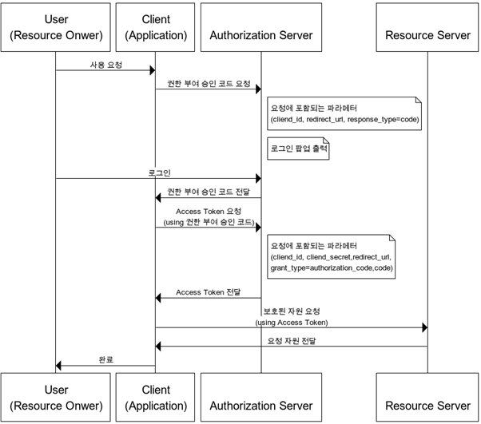
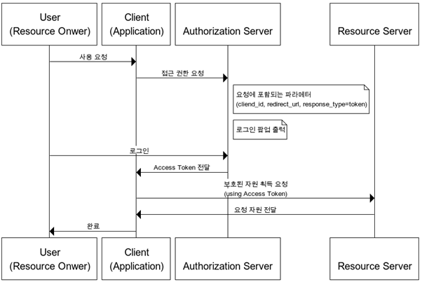
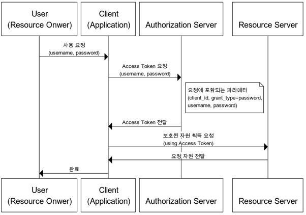
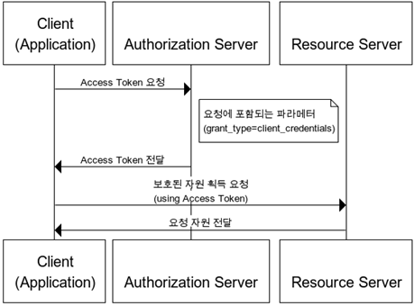

## Oauth 2.0의 4가지 동작 방식

#### 1. Authorization Code Grant │ 권한 부여 승인 코드 방식

#### 2. Implicit Grant │ 암묵적 승인 방식

#### 3. Resource Owner Password Credentials Grant │ 자원 소유자 자격증명 승인 방식

#### 4. Client Credentials Grant │클라이언트 자격증명 승인 방식

https://blog.naver.com/mds_datasecurity/222182943542